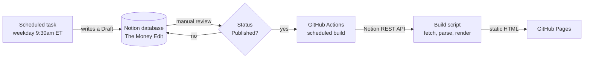

# The Money Edit

A daily finance and markets brief, written in plain language, published from Notion to a static site.

**Live at [aidenmark.github.io/the-money-edit](https://aidenmark.github.io/the-money-edit/)**

Each weekday an entry is researched and filed into a Notion database. Once it has been reviewed and promoted out of `Draft`, a scheduled build reads it, renders it as a designed card, and deploys the site. The whole thing runs without anyone opening a laptop.

The writing has one rule behind it. Every entry has to answer "what does this mean for my money," not just "what happened."

---

## How it works



Notion is the source of truth. The site is a pure function of it. Nothing is written back, and the output directory is wiped on every build, so unpublishing an entry in Notion actually removes it from the site rather than leaving a stale file behind.

### Why the build runs in CI

The entries arrive on a schedule but the laptop is not reliably open, so anything needing a manual trigger gets missed. Running the build in GitHub Actions means the site keeps up with Notion on its own.

This costs nothing. No language model runs in CI. The job calls the Notion REST API and writes HTML, and Actions minutes are free on a public repository. Research and writing happen upstream in the scheduled task, which is where the only real cost lives.

---

## Running it locally

Node 18.17 or newer. There is nothing to install, because the project has no dependencies.

```bash
git clone https://github.com/aidenmark/the-money-edit.git
cd the-money-edit

cp .env.example .env      # then paste your Notion token into it
npm run check             # confirms the token works and lists what it can see

npm run preview           # build from Notion and serve on localhost:4321
```

No token to hand? Everything except the live build works without one:

```bash
npm run preview:offline   # builds from committed fixtures of real entries
npm test
```

| Command | What it does |
|---|---|
| `npm run build` | Build from Notion into `dist/` |
| `npm run build:offline` | Build from the committed fixtures, no token or network needed |
| `npm run preview` | Build from Notion and serve it on `localhost:4321` |
| `npm run preview:offline` | Same, from fixtures |
| `npm run check` | Diagnose the Notion connection without printing the token |
| `npm test` | Run the test suite |

### Getting a Notion token

1. Create an internal integration at [notion.so/my-integrations](https://www.notion.so/my-integrations)
2. Copy the secret into `.env` as `NOTION_TOKEN`
3. **Open the database in Notion, use the `...` menu, choose Connections, and add the integration**

Step three is the one that catches people out. A valid token that has not been connected to the database returns an empty list with a `200`, which looks exactly like a database with no rows in it. `npm run check` reports that case specifically rather than letting you debug it as a code problem.

---

## Repository layout

```
src/
  notion.js    The only file that knows Notion exists
  parse.js     Turns a page body into sections, figures, a term, a source
  render.js    Pure functions, entries in, HTML strings out
  build.js     Orchestration and publishing policy
  config.js    Token loading from the environment or .env
  check.js     Connection diagnostics
  util.js      Dates, escaping, slugs, the stable hash
assets/
  styles.css   One stylesheet for all three page types
scripts/
  serve.js     A small static server for previewing
test/
  fixtures/    Real entries, captured from the live database
.github/workflows/
  ci.yml       Tests and an offline build on every push
  publish.yml  Scheduled build from Notion, deployed to Pages
```

The separation that matters most is `notion.js`. Everything downstream works with plain objects, so moving off Notion later means rewriting one file and nothing else.

---

## The entry format

The parser accepts three shapes, because the scheduled task's output changed over time and older entries still have to render. Going forward, write this one.

```markdown
## What happened
Two or three sentences. What moved, and by how much.

## Why it happened
The mechanism, in plain language. Define any term you have to use.

## What it means for you
The part that makes this worth reading. Mortgages, savings, groceries, jobs.

## Key figures
- S&P 500: down 0.5% to 7,703.78
- 30-year Treasury yield: 5.30%, highest since 2007

## Term of the day
Term of the day: Treasury yield. A Treasury yield is what the US government
pays to borrow money, and it sets the floor for mortgage rates everywhere else.

## Source
[Headline of the article](https://example.com/article)
```

Notes on the format:

- **`Headline` and `Content` are different fields.** `Headline` is a short scannable label of roughly 5 to 10 words. `Content` is the 2 to 4 sentence writeup. Putting the same sentence in both makes the Notion table view useless.
- **`Term of the day` builds the glossary.** The glossary page is not authored separately, it collects the term from each entry automatically. When a term is defined twice, the earliest definition wins, so the glossary credits the day a reader first met the word.
- **Key figures render as tiles.** Either `Label: value` or a middot separated line works. Direction is detected from words like `up` and `down` and shown as an arrow as well as a color.
- **Dates are resolved in `America/New_York`.** Always. An entry filed at 10:36pm Eastern is already the next day in UTC, and that produced a wrong date on the very first entry of this project. Use `TZ=America/New_York date +%F`.

---

## Design notes

The brief for the card was the Iron Man interface. I read that as precision and assembly rather than as military hardware, and softened it toward luxury, because the audience for this writing is not an engineering one.

- **One accent per day**, chosen by hashing the entry date against eight curated tones. A hash mapped onto the full hue wheel eventually lands on a color that looks wrong against this background, and there is nobody reviewing the site at 9:30am to catch it. A fixed set guarantees every day looks deliberate.
- **Hash the date, not the headline**, so an entry keeps its tone even if the headline is edited in Notion afterward.
- **No randomness anywhere.** `Math.random` appears nowhere in the project. A card rebuilt in December has to look identical to how it looked in August.
- **Numbers get the weight.** The figure panel sits above the prose, because the numbers are what someone opens this for at 9:30am.
- **Hairlines, not boxes.** Every border is one pixel and faint. Heavier borders turn panels into cards, and cards read as a blog.
- **The page assembles itself** on load. Each block carries a `--step` index and the stylesheet derives the delay from it, so adding a section never means touching the CSS.

### Accessibility

Motion is fully disabled under `prefers-reduced-motion`, which is not optional given how prominent the entrance is. Figure direction is carried by an arrow as well as by color. There is a skip link, `aria-current` on the active nav item, and screen reader headings on panels that are only visually implied. A print stylesheet renders a card as a readable document rather than as a dark screenshot.

### Two deliberate constraints

**No JavaScript ships to the browser.** The site works with scripting disabled and there is nothing to hydrate.

**No runtime dependencies.** Node 18 provides `fetch` and a test runner, and the Notion API is three endpoints. There is no `node_modules`, no lockfile, and no supply chain.

---

## Decisions and tradeoffs

**Hand rolled rather than a static site generator.** The site has three page types and the content model has four fields. A generator would be more to understand, not less. The cost is writing the RSS feed, the sitemap, and the HTML escaping by hand, which came to about 100 lines.

**Publishing policy lives in `build.js`, not in `notion.js`.** Deciding what the public sees is a product decision, not a transport concern. Two conditions apply: `Status` is `Published`, and the date is not in the future in New York. The second allows an entry to be approved ahead of time without appearing early.

**The parser is permissive.** Three body formats exist in the database. Rather than backfill old entries by hand or break them, the parser reads whatever is present and reports which shape it found.

**The empty state is a real state.** Every entry is filed as a draft, so a freshly built site legitimately has nothing on it. It says so plainly and still looks finished.

**Draft to Published stays manual.** It is the editorial gate, and automating it would remove the only review step in the pipeline.

---

## Deployment

`publish.yml` runs at 15:00 and 21:00 UTC on weekdays, on every push to `main`, and on demand from the Actions tab. Cron in GitHub Actions is always UTC and does not follow daylight saving, so 15:00 UTC lands at 11:00 Eastern in summer and 10:00 in winter. Both are after the entry is filed, which is what matters.

To publish immediately after promoting an entry in Notion:

```bash
gh workflow run publish.yml
```

One operational note: GitHub disables scheduled workflows after 60 days without repository activity. Any commit resets the clock.

### Moving to a custom domain

`SITE_BASE` and `SITE_ORIGIN` in `src/render.js` are the only two places a URL is encoded. Moving from the current project page to a custom domain is those two values, a `CNAME` file, and a DNS record. No search and replace through the templates.

---

## License

MIT
